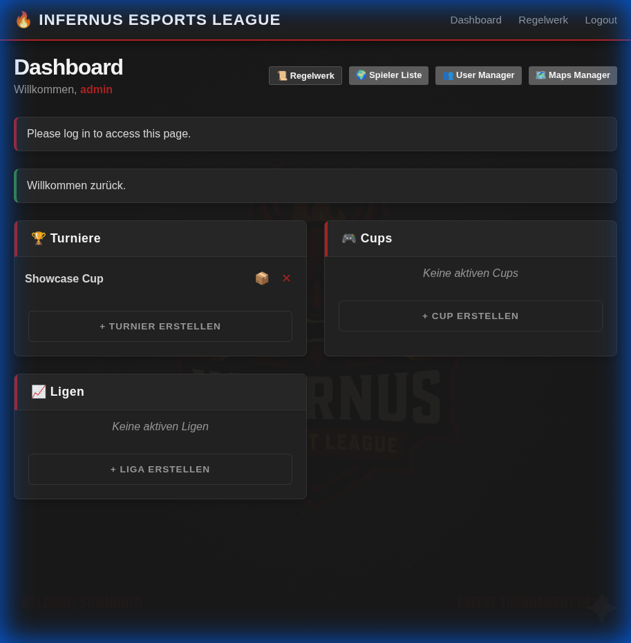
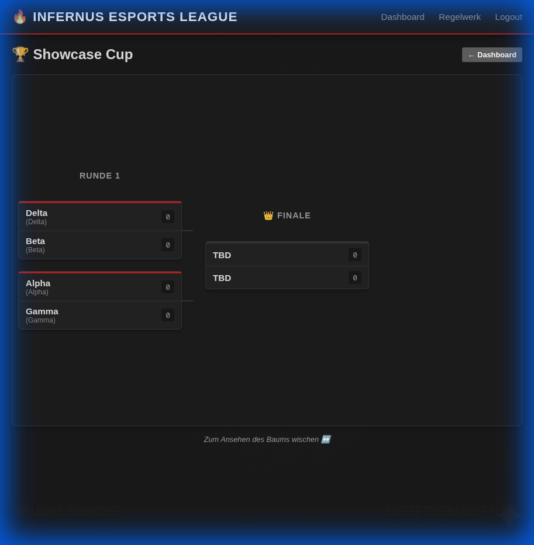
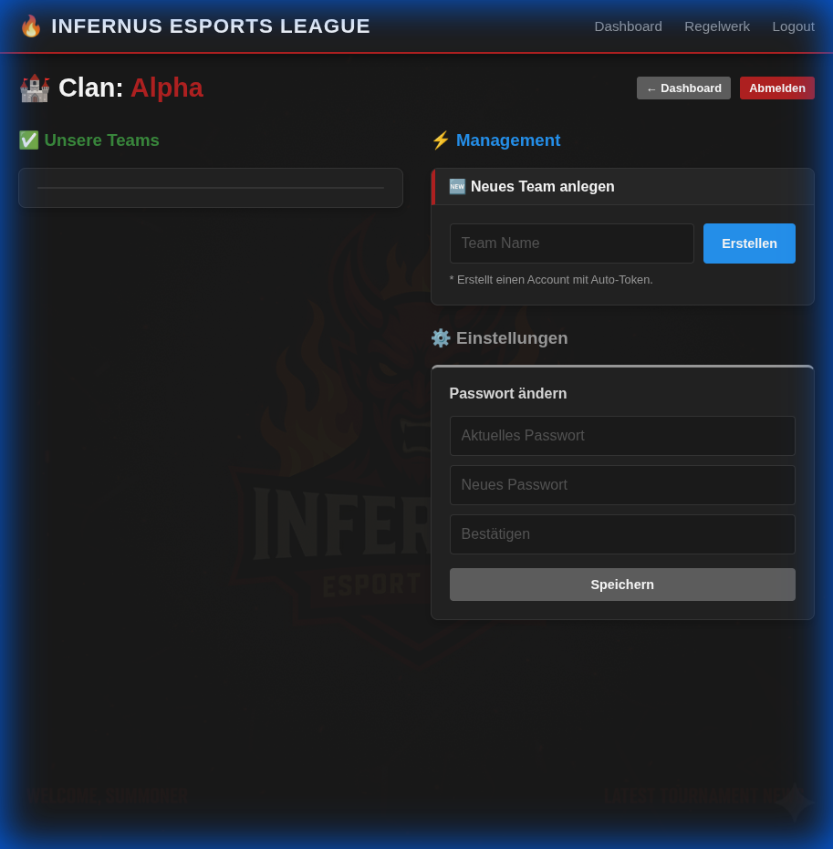
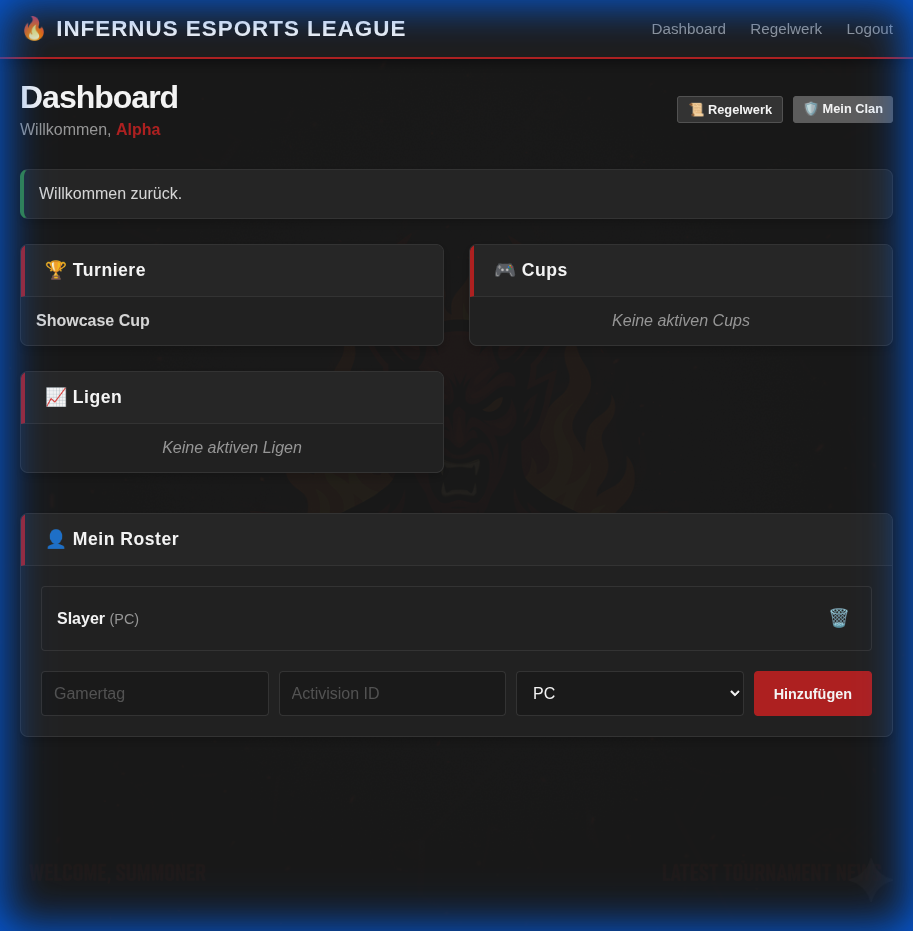
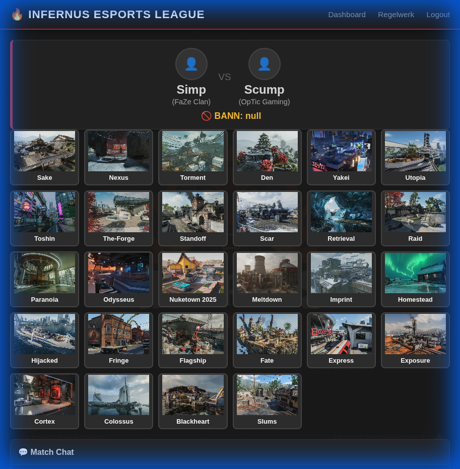
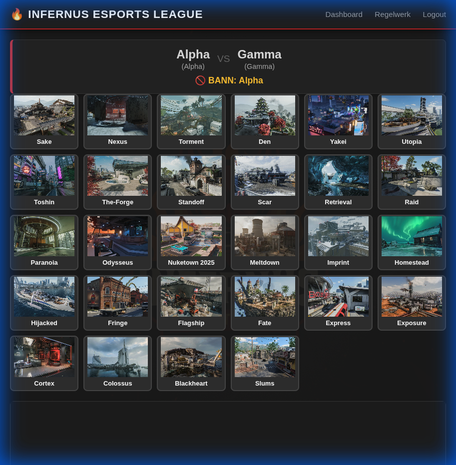
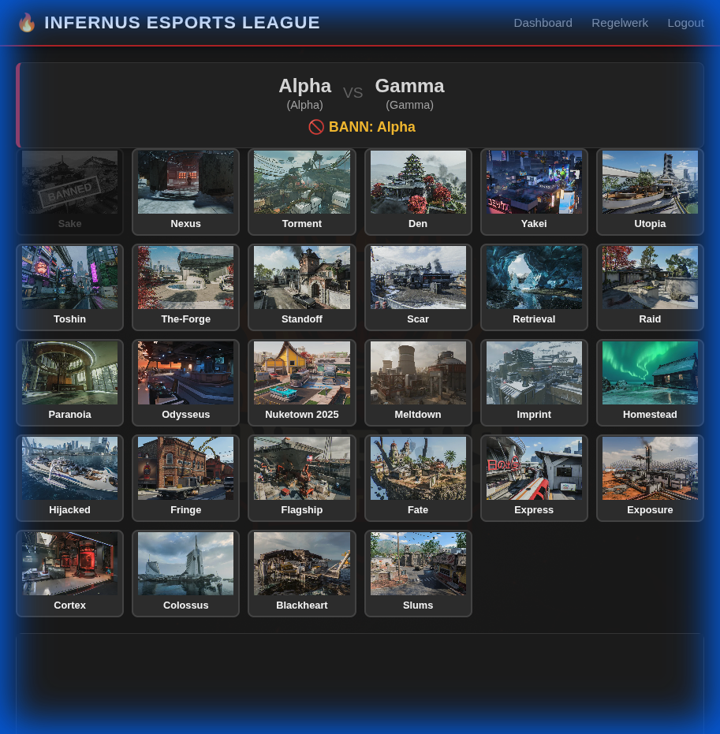

# Tournament 2.0 Manager

**Tournament 2.0 Manager** ist eine professionelle Webanwendung für die Verwaltung von E-Sports-Turnieren. Das System deckt den kompletten Lebenszyklus eines Turniers ab – von der Clan-Erstellung über das Bracket-Management bis hin zum Match-Reporting mit Beweis-Screenshots.

---

## 📸 Features & Screenshots

### 1. Admin Dashboard
Die Kommandozentrale für Administratoren. Hier sehen Sie aktive Turniere, Cups, Ligen und ausstehende Moderations-Aufgaben auf einen Blick.


### 2. Turnier-Management
Automatisch generierte Turnierbäume (Brackets) visualisieren den Fortschritt. Der Status jedes Matches (Waiting, Ban-Phase, Live, Finished) wird in Echtzeit angezeigt.


### 3. Benutzer- & Rechte-Verwaltung
Ein umfangreiches System zur Verwaltung von Nutzern, Moderatoren und Administratoren.
*   **Rechte-System**: Unterscheidung zwischen Admin, Mod, Clan-Leader und User.
*   **Übersicht**: Alle registrierten Clans und Spieler in einer durchsuchbaren Liste.


---

## 🛡️ Clan- & Team-System

Das Herzstück für Spieler. Jeder Clan verwaltet sich selbst.

### Clan Dashboard
Clan-Admins haben einen eigenen Bereich, um ihr Team zu organisieren.
*   **Token-System**: Einladung von Spielern via Token.
*   **Statistiken**: Übersicht der eigenen Matches und Ergebnisse.



### Roster Management
Pflegen Sie Ihr Lineup mit detaillierten Spieler-Infos (Gamertag, Activision-ID, Plattform).


### 3. Clean Team Names
Das System erkennt automatisch Clan-Tags in Benutzernamen (z.B. `FaZe.Simp`) und entfernt diese für eine saubere Darstellung in Match-Tabellen und Brackets (Anzeige: `Simp`). Der volle Name bleibt im Hintergrund erhalten.



---

## ⚔️ Match System & Pick/Ban

Professioneller Ablauf für jedes Match.

### Match Lobby
Sobald ein Match erstellt ist, treffen sich beide Teams in der Match Lobby. Hier werden Ergebnisse gemeldet und Beweise hochgeladen.



### Interaktive Pick & Ban Phase
Vor dem Spiel führen die Teams eine geführte Map-Veto-Phase durch. Das System gibt vor, wer wann bannen oder picken darf.



---

## 🚀 Installation

### Voraussetzungen
*   Python 3.8 oder höher
*   Pip
*   Zeitzone: Europe/Berlin (konfigurierbar)

### Setup

1.  **Repository klonen**
    ```bash
    git clone https://github.com/kruemmel2704/tournament-2.0.git
    cd tournament-2.0
    ```

2.  **Virtuelle Umgebung erstellen**
    ```bash
    python3 -m venv .venv
    source .venv/bin/activate  # Windows: .venv\Scripts\activate
    ```

3.  **Abhängigkeiten installieren**
    ```bash
    pip install -r requirements.txt
    ```

4.  **Starten**
    ```bash
    python run.py
    ```
    Die Anwendung läuft nun unter `http://localhost:5000`.

---

## 🐳 Docker

Starten Sie die Anwendung in Sekunden mit Docker Compose:

```bash
docker-compose up -d --build
```

---

## 🏗️ Technologie-Stack

*   **Backend**: Flask (Python)
*   **Datenbank**: SQLite (SQLAlchemy)
*   **Frontend**: HTML5, CSS3, JavaScript (Jinja2 Templates)
*   **Authentifizierung**: Flask-Login

---

*Entwickelt für professionelle E-Sports Organisation.*
